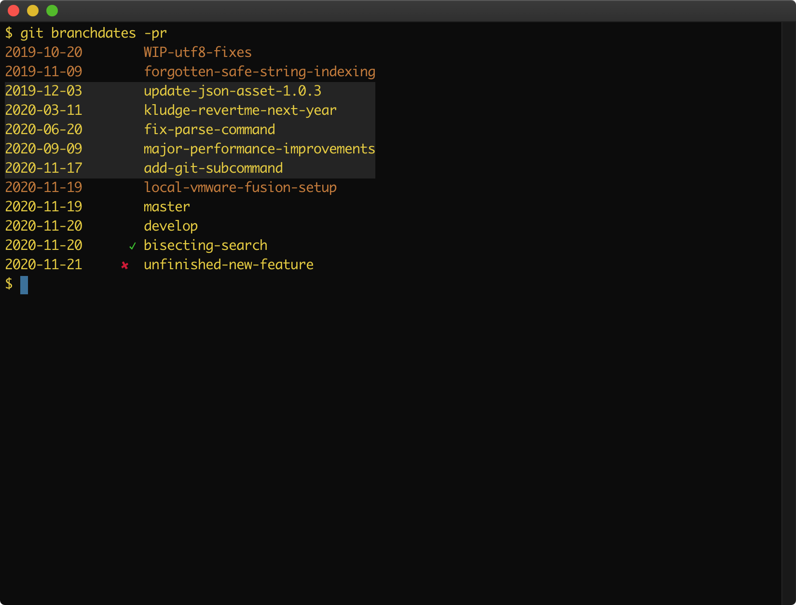

<a href="doc/images/git-branchdates-example.png">
    
</a>

# Overview

Highly configurable git branch lister with TrueColor and GitHub PR support.

 * [Quickstart](#quickstart)
 * [Features](#Features)
 * [Notes](#notes)
 * [Compatibility and Requirements](#compatibility-and-requirements)

# Quickstart

 * Place `bin/git-branchdates` on your `$PATH`
 * Remember to `chmod u+x git-branchdates`, too
 * Optionally install [gh](https://github.com/cli/cli)
   * And run `gh auth login` if so
 * Run `git branchdates` in a checked-out repository
 * Run `git branchdates -pr` for markup based on GitHub PRs

# Features

 * Branches are ordered by commit date *and* by checkout date, whichever is
   latest.  The checkout date is obtained from the reflog.

 * Branches may be colored, prefixed, or suffixed based on dozens of configurable
   status categories.  By default, branches are background-colored with gray
   based on merged status, and foreground-colored in brown based on lack of
   association with a remote.

 * With the `-pr` option, branch status also includes information about a
   branch's relationship to a PR on GitHub.  By default, CI status indicators
   are added for open PRs.

 * Modern terminal features are supported: TrueColor and anchor links.
   `git branchdates -pr -link` in [iTerm2.app](https://iterm2.com) will
   hyperlink branch names to PR URLs on command-click.

# Notes

## Settings

Many settings can be changed via `git config`.  For example, this setting
would cause `git-branchdates` to color branch names in pure white if they
are associated with a checked-out worktree (see `man git-worktree`):

```bash
git config --global branchdates.indicators.checked-out.fg '#FFFFFF'
```

Or, you might color a branch name red if it is a remote-tracking branch
which is also behind the remote:

```bash
git config --global branchdates.indicators.remote-behind.fg '#DC143C'
```

See the detailed helpdoc at `git branchdates -h`.

## Aliases

The author aliases `git branchdates` to `git bd` in `~/.gitconfig`:

```
[alias]
bd = branchdates
```

## Bugs

Does not support git's relative date formats.

# Compatibility and Requirements

Requires

 * perl 5.14+

which you typically already have.

Optionally

 * [gh](https://github.com/cli/cli) for the `-pr` option
